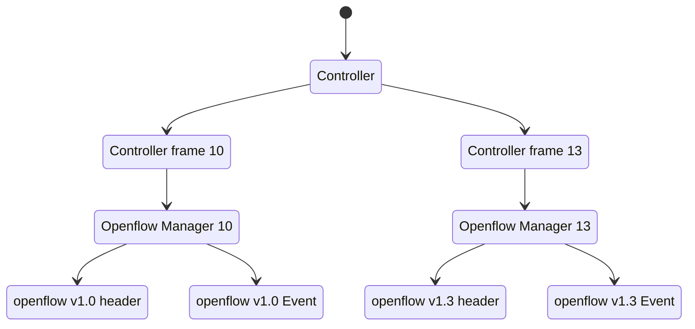

# Tenjin SDN

Software-defined networking with Rust.

## Goals

To understand The software-defined networking well, I trying to create a simple SDN with Rust language to support Openflow 1.0 first and 1.3 later.

## Get started

### Openflow 1.3

1. import Controller13 into main func.

```rust
use tenjin::{example, openflow::ofp13::ControllerFrame13};
extern crate byteorder;

fn main() -> Result<(), std::io::Error> {
    let controller = example::Controller13::new();
    controller.listener("127.0.0.1:6633");
    Ok(())
}
```

2. run Tenjin

```bash
cargo run --release
```

3. run mininet

```bash
sudo mn --controller=remote,ip=127.0.0.1 --mac --switch=ovsk,protocols=OpenFlow13 --topo=tree,2
```

### Openflow 1.0

import Controller10 into main func.

```rust
use tenjin::{example, openflow::ofp10::ControllerFrame10};
extern crate byteorder;

fn main() -> Result<(), std::io::Error> {
    let controller = example::Controller10::new();
    controller.listener("127.0.0.1:6633");
    Ok(())
}
```

run Tenjin

```bash
cargo run --release
```

run mininet

```
sudo mn --controller=remote,ip=127.0.0.1 --mac --switch=ovsk,protocols=OpenFlow10 --topo=tree,2
```

## TODOs

- [x] design structure of code and working.
- [x] test case. ([Read docs](https://doc.rust-lang.org/book/ch11-01-writing-tests.html))
- [ ] write more description in README.
- [x] handle needed messages.
- [x] remove all unwarp.

## Learning resources

- [rust_ofp](https://github.com/baxtersa/rust_ofp)
- [awesome-sdn](https://github.com/sdnds-tw/awesome-sdn)
- [ryu](https://github.com/faucetsdn/ryu)
- [learn-sdn-with-ryu](https://github.com/knetsolutions/learn-sdn-with-ryu)

## Plan

<details>
<summary>Diagram</summary>



</details>
