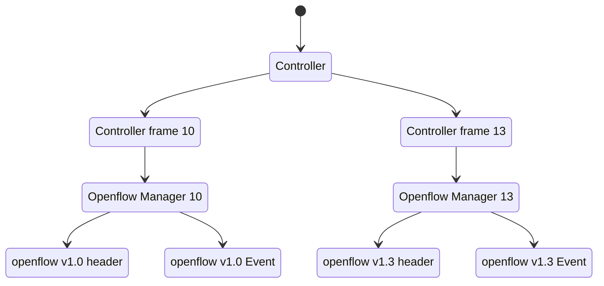

# Tenjin SDN

Tenjin is The software-defined networking framework written in Rust, offering high performance and memory safety. It can be used as both a framework and a command line tool.

## Menu

- [Installation to your project](#Installation-to-your-project)
- [Installation for cli](#Installation-for-cli)
- [Cli usage](#Cli-usage)
- [Run The example controller](#Run-The-example-controller)
- [Mininet](#Mininet)

## Installation to your project

```
cargo add tenjin_sdn
```

if you pefer to use with `example` Controller

```
cargo install --features=example tenjin_sdn
```


## Installation for cli

### Install [Rust](https://www.rust-lang.org/)

[official webpage installation](https://www.rust-lang.org/tools/install)

or run this command below. (For macOS, Linux, or another Unix-like OS)

```
curl --proto '=https' --tlsv1.2 -sSf https://sh.rustup.rs | sh
```

### Install Tenjin

```
cargo install tenjin_sdn
```

## Cli usage

#### Run Controller by default (Controller13 with OpenFlow 1.3)

```bash
tenjin run
```

#### Run Controller10 with Openflow 1.0

```bash
tenjin run ctrl10
```

#### Run with specific port

```bash
tenjin run --port 6653
```

```bash
tenjin run --port 6653,6633
```


#### Show details of `run` command

```bash
tenjin run --help
```

## Run The example controller

After you install `tenjin_sdn` to your project with feature `example`, you can run example controller with this code below.

### Openflow 1.3

```rust
use tenjin::{example, openflow::ofp13::ControllerFrame13};
extern crate byteorder;

fn main() {
    let controller = example::Controller13::new();
    controller.listener("127.0.0.1:6633");
}
```

### Openflow 1.0


```rust
use tenjin::{example, openflow::ofp10::ControllerFrame10};
extern crate byteorder;

fn main() {
    let controller = example::Controller10::new();
    controller.listener("127.0.0.1:6633");
}
```

## Mininet

Mininet is a network emulator to create virtual networks for rapid prototyping of Software-Defined.
Using mininet for testing this SDN Framework.

### Run Mininet with Openflow 1.3

```bash
sudo mn --controller=remote,ip=127.0.0.1 --mac --switch=ovsk,protocols=OpenFlow13 --topo=tree,2
```

### Run Mininet with Openflow 1.0

```bash
sudo mn --controller=remote,ip=127.0.0.1 --mac --switch=ovsk,protocols=OpenFlow10 --topo=tree,2
```

## Learning resources

- [Openflow 1.3 Document](https://opennetworking.org/wp-content/uploads/2014/10/openflow-spec-v1.3.0.pdf)
- [rust_ofp](https://github.com/baxtersa/rust_ofp)
- [awesome-sdn](https://github.com/sdnds-tw/awesome-sdn)
- [ryu](https://github.com/faucetsdn/ryu)
- [learn-sdn-with-ryu](https://github.com/knetsolutions/learn-sdn-with-ryu)

## Plan

<details>
<summary>Diagram</summary>



</details>
