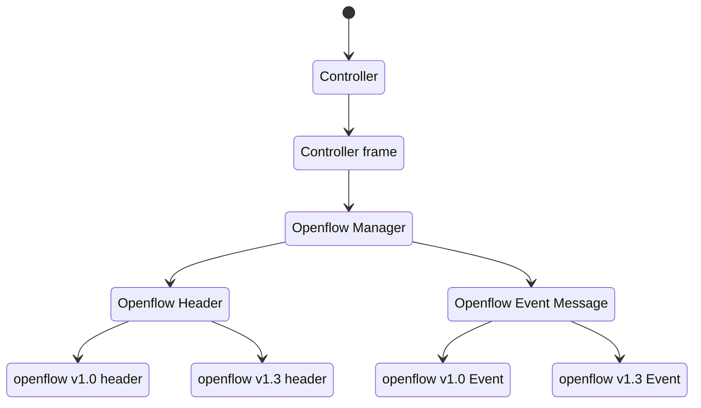

# Tenjin SDN 

## Goals

To understand  The software-defined networking well, I trying to create a simple SDN with Rust language  to support Openflow 1.0 first and 1.3 later.

## TODOs

- [x] design structure of code and working.
- [x] test case. ([Read docs](https://doc.rust-lang.org/book/ch11-01-writing-tests.html))
- [ ] write more description in README.

## Learning resources

- [rust_ofp](https://github.com/baxtersa/rust_ofp)
- [awesome-sdn](https://github.com/sdnds-tw/awesome-sdn)
- [ryu](https://github.com/faucetsdn/ryu)
- [learn-sdn-with-ryu](https://github.com/knetsolutions/learn-sdn-with-ryu)

## Plan

