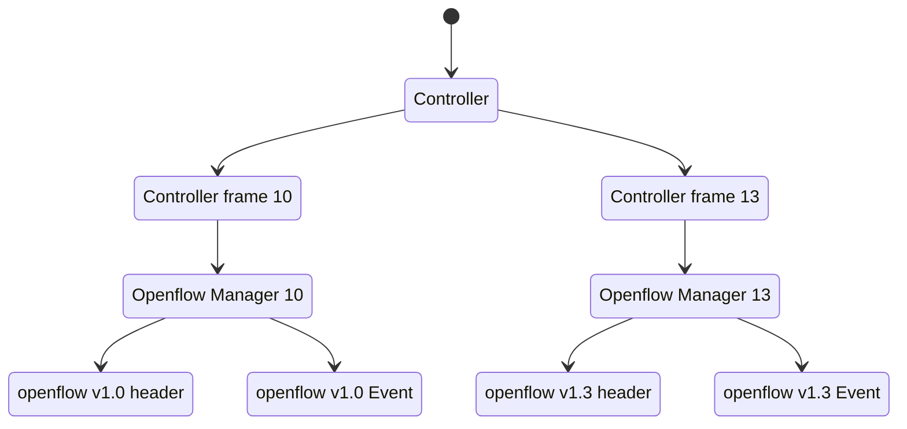

# Tenjin SDN

Software-defined networking with Rust.

## Goals

To understand The software-defined networking well, I trying to create a simple SDN with Rust language to support Openflow 1.0 first and 1.3 later.

## Installation

### Install [Rust](https://www.rust-lang.org/)

[official webpage installation](https://www.rust-lang.org/tools/install)

or run this command below. (For macOS, Linux, or another Unix-like OS)

```
curl --proto '=https' --tlsv1.2 -sSf https://sh.rustup.rs | sh
```

### Install Tenjin

```
cargo install tenjin_sdn
```

## Run with command line

#### Run Controller by default (Controller13 with OpenFlow 1.3)

```bash
tenjin run
```

#### Run Controller10 with Openflow 1.0

```bash
tenjin run ctrl10
```

#### Run with specific port

```bash
tenjin run --port 6653
```

```bash
tenjin run --port 6653,6633
```


#### Show details of `run` command

```bash
tenjin run --help
```

## Run only Controller

You can add tenjin to your project with command

```
cargo add tenjin
```

Or you can clone this source code into your workspace and modify the code.

this code below is the example for run only Controller.
If you would like to modify Controller's code, it waiting for you at ./src/example/

### Openflow 1.3

1. import Controller13 into main func.

```rust
use tenjin::{example, openflow::ofp13::ControllerFrame13};
extern crate byteorder;

fn main() {
    let controller = example::Controller13::new();
    controller.listener("127.0.0.1:6633");
}
```

2. run Tenjin

```bash
cargo run --release
```

### Openflow 1.0

import Controller10 into main func.

```rust
use tenjin::{example, openflow::ofp10::ControllerFrame10};
extern crate byteorder;

fn main() {
    let controller = example::Controller10::new();
    controller.listener("127.0.0.1:6633");
}
```

run Tenjin

```bash
cargo run --release
```

## Mininet

Mininet is a network emulator to create virtual networks for rapid prototyping of Software-Defined.
Using mininet for testing this SDN Framework.

### Run Mininet with Openflow 1.3

```bash
sudo mn --controller=remote,ip=127.0.0.1 --mac --switch=ovsk,protocols=OpenFlow13 --topo=tree,2
```

### Run Mininet with Openflow 1.0

```bash
sudo mn --controller=remote,ip=127.0.0.1 --mac --switch=ovsk,protocols=OpenFlow10 --topo=tree,2
```

## TODOs

- [x] design structure of code and working.
- [x] test case. ([Read docs](https://doc.rust-lang.org/book/ch11-01-writing-tests.html))
- [ ] write more description in README.
- [x] handle needed messages.
- [x] remove all unwarp.

## Learning resources

- [rust_ofp](https://github.com/baxtersa/rust_ofp)
- [awesome-sdn](https://github.com/sdnds-tw/awesome-sdn)
- [ryu](https://github.com/faucetsdn/ryu)
- [learn-sdn-with-ryu](https://github.com/knetsolutions/learn-sdn-with-ryu)

## Plan

<details>
<summary>Diagram</summary>



</details>
